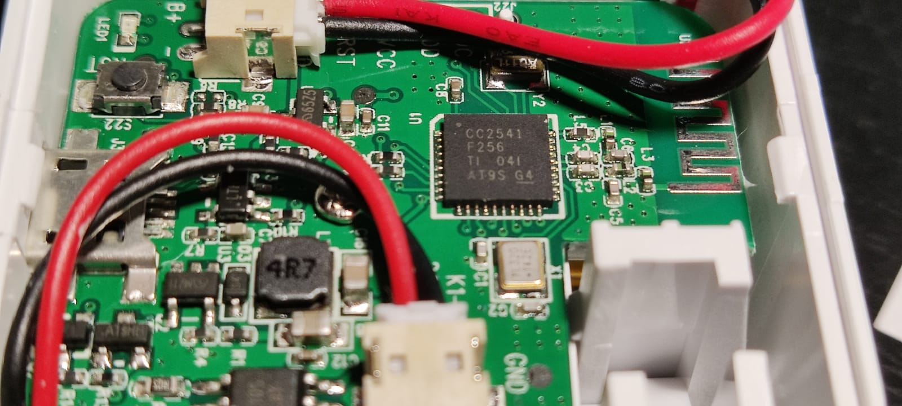

# pyMagicSwitchbot

This is a Python library that allows the integration of *Magic Switchbot* devices in open source projects like home automation.

## Product description

The [Magic Switchbot device](https://www.interear.com/smart-products/magic-bluetooth-switchbot.html) is apparently a clone of the *Switchbot* manufactured by the Chinese company *Shenzhen Interear Intelligent Technology Co., Ltd*.

If we open the device (which is easy just lifting a lid), we can see it is based upon a low power and high performance [**CC2541**](https://www.ti.com/product/CC2541) SOC chip, manufactured by Texas Instruments. It is compatible with BLE (Bluetooth Low Energy) 4.0.

This is the board overview we see when opening the lid:

The device has an internal 360mAh LiPo battery that can be recharged via its MicroUSB connector and according to the manufacturer its charge can last up to 2 or 3 months.

The device has 2 different working modes:

* **Switch**.
  In this mode, you can *turn on* or *turn off* a device. For this mode to work, the manufacturer provides an extension "hook" that can be attached to the physical switch you want to activate, so that when you *turn off* it effectively *pulls* the hook. You can watch a video tutorial [in this link](https://cloud.video.alibaba.com/play/u/2153292369/p/1/e/6/t/1/d/hd/278038162598.mp4).

* **Push button**.

  In this mode, the device simply *pushes* the object to which it is attached for a second and then retracts to its original position every time you activate it.

## Device API and protocol

The device uses a *propietary* BLE protocol that I documented based on information provided by the manufacturer and some reverse engineering of the bluetooth logs and the original [Android App](https://play.google.com/store/apps/details?id=com.runChina.moLiKaiGuan&hl=es&gl=US).

The documentation is published [here](doc/MagicSwitchBot_API.md).

## References

The library is based on `bluepy`, so it does not work on Windows.

The code is strongly influenced by [pySwitchbot](https://github.com/Danielhiversen/pySwitchbot) library by [Daniel Hjelseth Høyer (Danielhiversen)](https://github.com/Danielhiversen). My original idea was to modify this library and make it work for both devices families, but the internal working mode is quite different and most of the code was going to be different, so I decided to start a new project but using some of his good techniques and code.

## Library usage

